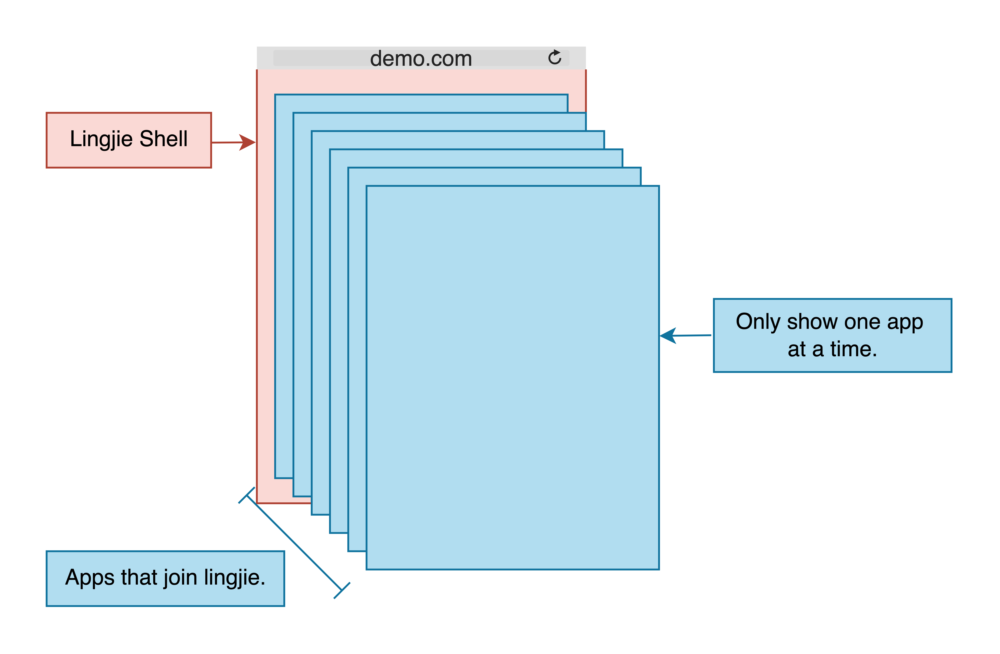

# 零界微前端工作原理
## 基本工作原理

所有加入零界微前端的应用都会以 `iframe` 的形式加载在零界中。

零界微前端通过一个 `microapp-shell` 页面，作为一个壳，管理多个 iframe 的加载和切换。

因此，每个加入零界微前端的应用都需要加载一个脚本去重定向到 `shell` 页面，之后零界就会接管这个应用（iframe）。

&nbsp;

所以，零界微前端由两部分组成：

* 一个是 shell 。一个普通的html页面只需引入 `lingjie-shell` 脚本就能成为一个 shell ，为了让指定应用加入 shell ，还需要在 shell 中配置允许加入的路径匹配规则和相关行为。
* 另一个是所有加入零界微前端的应用。每个加入零界微前端的应用只需引入一个 `lingjie-page` 脚本，即可在加载应用的时候跳转到 shell ，之后让零界微前端进行管理。

在 shell 中，零界微前端会通过 history api 如 `pushState` 和 `replaceState`，将当前激活的页面的地址，同步到浏览器地址栏里的 `location` 中。因此刷新、回退、前进页面完全不会丢失路由状态。

&nbsp;

## iframe限制
为了避免 iframe 消耗过多的浏览器资源，零界管理的 iframe 上限为 **10** 个。零界将管理的 iframe 存储在队列中，先入先出（FIFO），当数量达到上限时，之后每新增一个 iframe 都会相应地在队尾删除一个 iframe。

&nbsp;

## iframe的滑入、滑出

当前窗口宽度小于 **800px** 时，在零界微前端中切换页面会有类似 Native App 中 WebView 的滑入、滑出动画。

&nbsp;

## 跳转劫持机制

零界微前端会监听页面所有 `a` 标签的点击事件，如果有需要的话会改写默认行为，按照以下条件逐一判断：

1. 是否设置了 `target="_blank"`：
    - 如果是，在新tab中正常打开页面
    - 如果否，则下一步
2. 判断 `a.href` 是否匹配当前域名：
    - 如果是，不刷新重新加载页面
    - 如果否，则下一步
3. 判断是否命中 shell 里的 **路径规则表** :
    - 如果是，阻止默认行为，新增一个 iframe 加载目标页面，等待目标页面可以展示时，切换展示
    - 如命否，则不做劫持

特殊情况下，没有 `a` 标签时，可以采用下面的方式跳转页面。

[通过零界微前端的 API 跳转页面](/docs/usage.html?title=lingjie-JS-API)

&nbsp;

###### [配置零界shell和零界page](/docs/usage.html?title=lingjie-shell-and-lingjie-page)